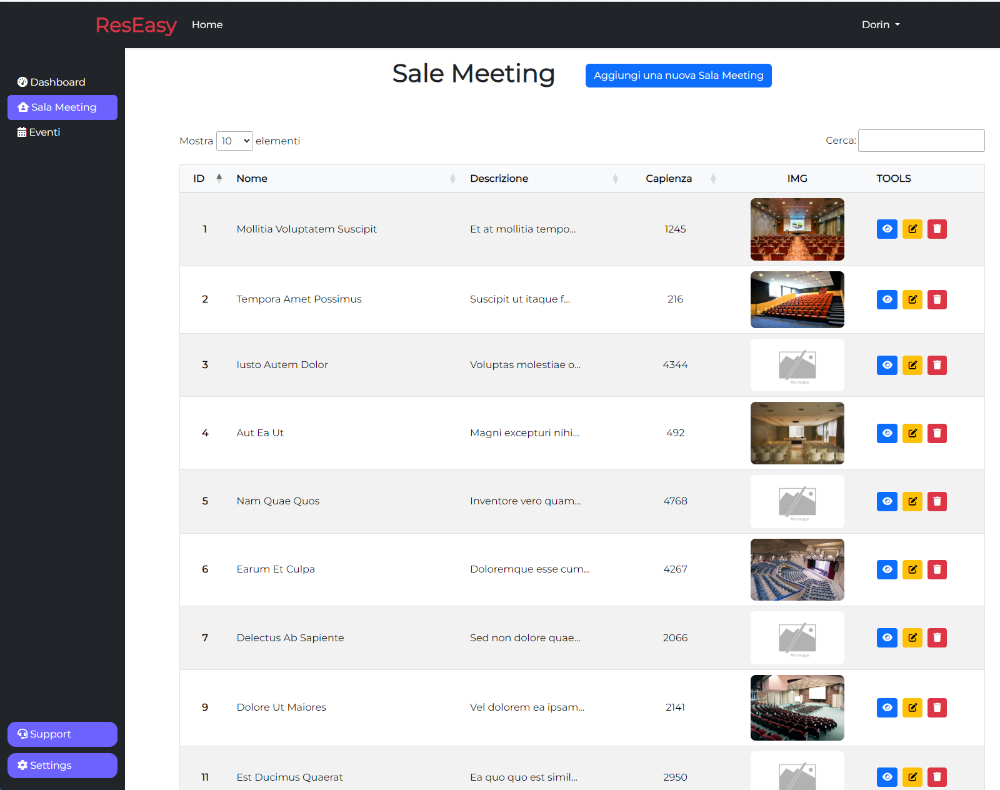
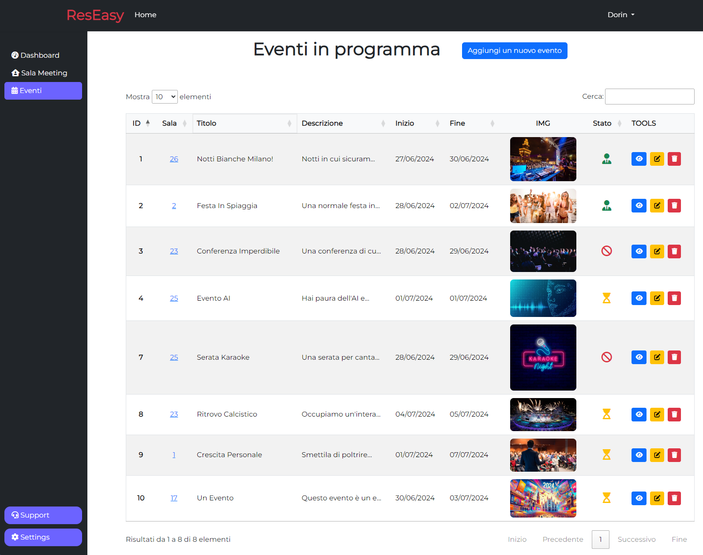
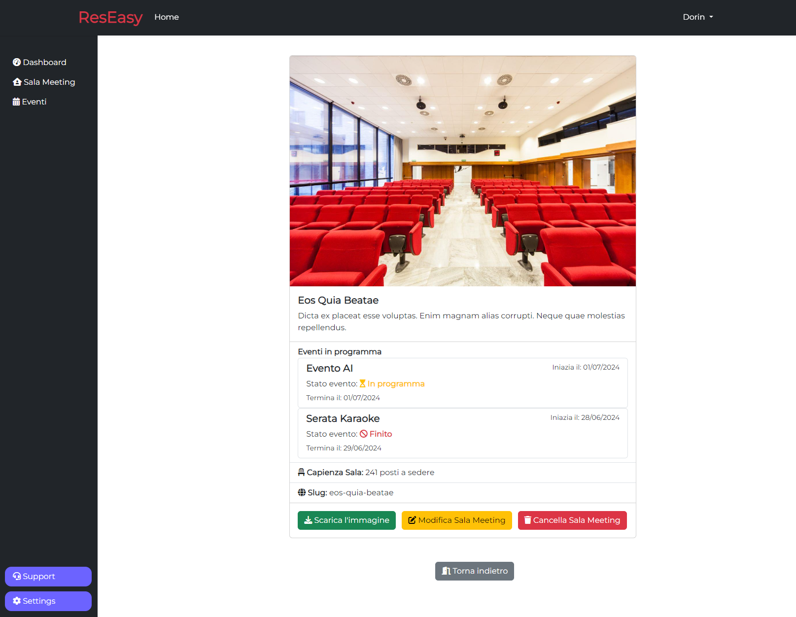

<a name="readme-top"></a>

<!-- BADGE -->


[![LinkedIn][linkedin-shield]](https://www.linkedin.com/in/dorin-vieru-1997dev/)

<!-- LOGO -->
<br />
<div align="center">
  <a href="https://github.com/DorinVieru/full-stack-sale-eventi">
    <a href="https://laravel.com" target="_blank">
  </a>

  <h3 align="center">Gestionale Sale Eventi: ResEasy</h3>

  <p align="center">
    Il gestionale che ti facilita la tua organizzazione!
    <br />
    <a href="https://github.com/DorinVieru/full-stack-sale-eventi"><strong>Visualizza il codice »</strong></a>
    <br>
  </p>
</div>


<!-- INDICE -->
<details>
  <summary>Indice</summary>
  <ol>
    <li>
      <a href="#multilanguage">Multilanguage</a>
    </li>
    <li>
      <a href="#argomenti-trattati">Argomenti trattati</a>
    </li>
    <li>
      <a href="#consegna-del-progetto">Consegna del progetto</a>
      <ul>
        <li><a href="#tecnologie-utilizzate">Tecnologie utilizzate</a></li>
      </ul>
    </li>
    <li>
      <a href="#per-iniziare">Per iniziare</a>
      <ul>
        <li><a href="#prerequisiti">Prerequisiti</a></li>
        <li><a href="#installazione">Installazione</a></li>
        <li><a href="#laravel-per-saperne-di-più">Laravel: per saperne di più</a></li>
      </ul>
    </li>
    <li><a href="#documentazione">Documentazione</a></li>
    <li><a href="#contatti">Contatti</a></li>
    <li><a href="#licenza">Licenza</a></li>
  </ol>
</details>

<!-- Multilanguage -->
## Multilanguage
Read the README in other languages: [README-EN](README-EN.md).

<!-- ARGOMENTI TRATTATI -->
## Argomenti trattati
- Modellazione DB
- Migrations e Seeders
- Models e Controllers
- Routing web e routing API
- Autenticazione
- [Funzioni anonime in php](https://www.php.net/manual/en/functions.anonymous.php)
- File storage e upload immagine
- Gestione delle date (Carbon)


<!-- CONSEGNA -->
## Consegna del Progetto

<div>
  <h4>Desktop View</h4>
  
  
  
</div>
<br>


📚 📑 **Consegna** <br>
Realizziamo un’applicazione in Laravel che gestisce la creazione e la prenotazione in maniera interattiva di Eventi e Sale Meeting.
E’ prevista una sola tipologia di utente: admin. L’admin ha accesso alla creazione degli Eventi e delle Sale Meeting e all’assegnazione del singolo Evento ad una Sala Meeting.

Sugli eventi sono possibili le seguenti operazioni: creazione e assegnazione ad una singola Sala Meeting in un dato intervallo di giorni. Un evento deve essere obbligatoriamente assegnato ad una sala meeting **disponibile** in quelle date in fase di creazione.

### Milestone

1️⃣ **Milestone 1** <br>
Sviluppare un diagramma ER per le entità e le relazioni dell’applicativo.

2️⃣ **Milestone 2** <br>
Seguendo il diagramma creato nella prima milestone, creiamo e popoliamo il database attraverso migrations e seeders (si consiglia l’uso dei Faker per popolare le risorse).

Teniamo presente che una entità Sala Meeting dovrà avere almeno le seguenti caratteristiche:

- id
- nome
- descrizione
- numero posti disponibili

Mentre una entità Evento dovrà avere almeno le seguenti caratteristiche:

- id
- titolo
- descrizione
- data inizio
- data fine
- immagine

e inoltre dovrà avere una sala meeting ad esso assegnata.

3️⃣ **Milestone 3**

Realizziamo un setup dell’applicativo con backoffice e autenticazione riservata ad un unico utente amministratore: l’admin.

4️⃣ **Milestone 4**

Aggiungiamo la possibilità di creare un nuovo Evento, a cui andrà obbligatoriamente assegnata anche una sala meeting. Nella selezione possiamo includere tutte le sale meeting.

5️⃣ **Milestone 5**

Aggiungiamo la possibilità di creare una nuova Sala Meeting.

6️⃣ **Milestone 6**

Aggiungiamo la possibilità di assegnare in fase di creazione ad un evento **esclusivamente le sale meeting disponibili nelle date selezionate,** controllandone quindi la disponibilità in un dato intervallo di giorni.
Una sala meeting può avere solo un evento per ogni giorno, un evento può durare più giorni consecutivi e solo in una sala meeting.

Una sala meeting è quindi occupata quando:

- Esiste un evento in quella data

🌟**Bonus**: <br>
Realizzare CRUD aggiuntive per le due entità presenti nel progetto.


<p align="right">(<a href="#readme-top">torna all'inizio</a>)</p>

<!-- tecnologie utilizzate -->
### Tecnologie utilizzate

Di seguito le tecnologie utilizzate per la realizzazione di ResEasy:

|      Nome Tecnologia      |                         Icona                                                                |
| :----------------------:  | :------------------------------------------------------------------------------------------: |
|         `Html`            |    [](https://skillicons.dev)               |
|         `Css`             |  [](https://skillicons.dev)                  |
|         `SASS`            |     [](https://skillicons.dev)              |
|       `Bootstrap`         |       [](https://skillicons.dev)       |
|      `Javascript`         |       [](https://skillicons.dev)              |
|        `Laravel`          |    [](https://skillicons.dev)            |
|          `PHP`            |    [](https://skillicons.dev)                |
|         `MySQL`           |    [](https://skillicons.dev)              |
|          `npm`            |    [](https://skillicons.dev)                |

<p align="right">(<a href="#readme-top">torna all'inizio</a>)</p>


<!-- PER INIZIARE -->
## Per iniziare

Se si desidera installare l'applicazione in locale, ci sono diversi passaggi a cui prestare attenzione. Li ho riassunti qui di seguito, qualora ci fossere complicazioni vi rimando alla documentazione ufficiale per ogni tipo di comando che dovete inserire.

<!-- PREREQUISITI -->
### Prerequisiti

Prima di tutto, è essenziale inizializzare / creare una nuova cartella in locale. Useremo il terminale, digitando il comando necessiare per installare laravel.

  ```
  composer create-project laravel/laravel nome_progetto
  ```
Per "nome_progetto" si intende il nome del vostro personale progetto che desiderate creare, non il progetto da clonare da GitHub. <br>
Successivamente aprite il progetto appena creato nel vostro Visual Studio Code.

<!-- INSTALLAZIONE -->
### Installazione

_Qui di seguito potete trovare un esempio di come clonare la repo in locale, ma non è l'unico metodo. Qualora foste a conoscenza di un metodo migliore, utilizzatelo._

1. Una volta all'interno di Visual Studio Code, aprite il terminale andando nel voce del menu 'Terminal' e poi 'New Terminal'
2. Clonate la repo digitando il seguente comando
   ```
   git clone https://github.com/DorinVieru/full-stack-sale-eventi.git
   ```
3. Eliminate i vostri file del progetto (<strong>NON ELIMINATE IL FILE .env</strong>) e lasciate soltanto la cartella 'full-stack-eventi'. Prendetene il contenuto e spostatelo nella cartella principale del vostro progetto.
4. Nel file .env modificate la connessione al database (se volete usare mysql) alla riga 22
    ```
    DB_CONNECTION=mysql
    DB_HOST=127.0.0.1
    DB_PORT=3306
    DB_DATABASE= il nome che vuoi dare al database
    DB_USERNAME= root
    DB_PASSWORD= (lascia vuoto se non vuoi inserire nessuna password)
   ```
5. Avviate PHP Launcher (se utilizzate Windows) o MAMP (se utilizzate Mac)
6. Instalalte il preset di pacific dev (<a href="https://packagist.org/packages/pacificdev/laravel_9_preset">per maggiori info</a>)
    ```
   composer require pacificdev/laravel_9_preset
   ```
7. Installate lo scafolding per Bootstrap, Sass e Vite
    ```
   php artisan preset:ui bootstrap --auth
   ```
8. Successivamente potete avviare il comando per npm
    ```
   npm i
   ```
   ```
   npm run dev
   ```
9. Infine avviate l'applicazione con php
   ```
   php artisan serve
   ```
<p align="right">(<a href="#readme-top">torna all'inizio</a>)</p>

<!-- LARAVEL PER SAPERE DI PIU -->
## Laravel: per saperne di più

Laravel è un framework per applicazioni web con una sintassi espressiva ed elegante. Crediamo che lo sviluppo debba essere un'esperienza piacevole e creativa per essere veramente appagante. Laravel elimina le difficoltà dello sviluppo semplificando i compiti comuni utilizzati in molti progetti web, come:

- [Motore di routing semplice e veloce](https://laravel.com/docs/routing).
- [Potente contenitore per l'injection delle dipendenze](https://laravel.com/docs/container).
- Molti back-end per l'archiviazione delle [sessioni](https://laravel.com/docs/session) e della [cache](https://laravel.com/docs/cache).
- [Database ORM](https://laravel.com/docs/eloquent) espressivo e intuitivo.
- [Migrazioni](https://laravel.com/docs/migrations) indipendenti dal database.
- [Elaborazione dei job in background robusta](https://laravel.com/docs/queues).
- [Broadcasting degli eventi in tempo reale](https://laravel.com/docs/broadcasting).

Laravel è accessibile, potente e fornisce gli strumenti necessari per applicazioni grandi e robuste.

<p align="right">(<a href="#readme-top">torna all'inizio</a>)</p>


<!-- DOCUMENTAZIONE -->
## Documentazione

Qui l'elenco della documentazione ufficiale per i servizi utilizzati:
- [npm](https://www.npmjs.com/)
- [Laravel](https://laravel.com/docs)
- Se vuoi approfondire Laravel, ecco dove puoi farlo: [Laravel Bootcamp](https://bootcamp.laravel.com) e [Laracasts](https://laracasts.com).
- [PHP](https://www.php.net/docs.php)
- [MySQL](https://dev.mysql.com/doc/) (per il database)
- [Bootstrap](https://getbootstrap.com/) (stilizzazione del progetto)
- [Google Fonts](https://fonts.google.com/) per il font principale del progetto

<p align="right">(<a href="#readme-top">torna all'inizio</a>)</p>


<!-- CONTATTI -->
## Contatti

Dorin Vieru
- Linkedin: https://www.linkedin.com/in/dorin-vieru-1997dev/
- Email: <a href="mailto:info@dorinvieru.it">info@dorinvieru.it</a>

Link al progetto: [https://github.com/DorinVieru/full-stack-sale-eventi](https://github.com/DorinVieru/full-stack-sale-eventi)

<p align="right">(<a href="#readme-top">torna all'inizio</a>)</p>

<!-- LICENZA -->
## Licenza
Laravel è un framework open-source con licenza [MIT license](https://opensource.org/licenses/MIT).

<p align="right">(<a href="#readme-top">torna all'inizio</a>)</p>

<!-- MARKDOWN LINKS -->
[linkedin-shield]: https://img.shields.io/badge/-LinkedIn-black.svg?style=for-the-badge&logo=linkedin&colorB=555
[linkedin-url]: https://linkedin.com/in/othneildrew
